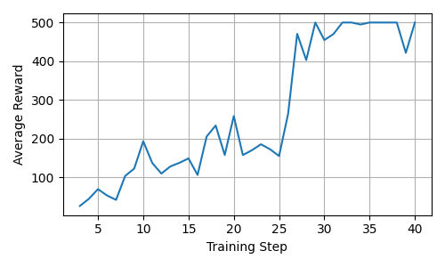
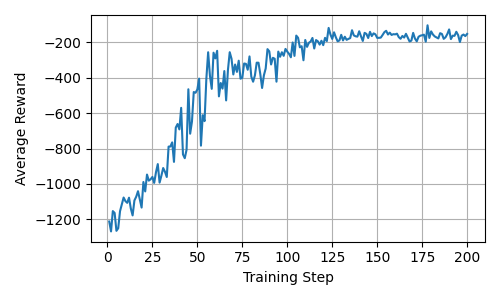

# my_zero

`my_zero` is my from-scratch implementation of **MuZero** and **Sampled MuZero**.
I built it to understand the algorithms beyond their high-level descriptions: how
the learned dynamics model, Monte Carlo tree search (MCTS), self-play, replay, and
recurrent training fit together. This is a personal research and learning project,
but includes end-to-end examples for both discrete and continuous control.

## What is implemented

- MuZero's representation, dynamics, and prediction networks
- PUCT-based MCTS for discrete action spaces
- Sampled MuZero search for continuous action spaces
- Multi-step recurrent training of policy, value, and reward predictions
- Scalar and categorical-support value/reward targets
- Standard and prioritized experience replay
- Parallel self-play workers
- Checkpointing, JSONL metrics, and TensorBoard logging
- Root-level legal-action masking in discrete MCTS
- Environment-metric callbacks and multi-agent observations

MuZero learns and searches in a latent state space: it does not need to reconstruct
future observations or receive the environment's transition model. Sampled MuZero
extends the same idea to large or continuous action spaces by searching over sampled
candidate actions.

## Installation

Python 3.10 or newer is required. From the repository root:

```bash
python -m venv .venv
source .venv/bin/activate
python -m pip install --upgrade pip
python -m pip install -e .
```

The package depends on PyTorch, Gymnasium, NumPy, and TensorBoard. The examples use
Gymnasium's built-in classic-control environments, so no additional environment
package is needed.

## Run an example

### MuZero on CartPole

This example uses the standard MuZero search over a discrete action space:

```bash
python examples/cart_pole_train.py
```



In this representative run, the average episodic return reaches CartPole's maximum
return of 500. The plotted values are from one training run, not an aggregate
benchmark.

### Sampled MuZero on Pendulum

This example uses Sampled MuZero to search a continuous action space:

```bash
python examples/pendulum_train.py
```



The representative run shows the average return improving from approximately
−1,250 to approximately −200. The full configuration is intentionally substantial
and can take much longer than the CartPole example; reduce `n_iterations`,
`mcts_num_simulations`, `self_play_episodes_per_iteration`, or
`SGD_steps_per_iteration` in the script for a quicker smoke test.

Both examples run on CPU by default and use multiple self-play workers. Their
network and trainer configurations are kept directly in the scripts so that the
important experimental choices are easy to inspect and modify.

## Training output

During training, the examples write artifacts to:

```text
logs/<environment>/                 JSONL metrics and TensorBoard events
checkpoints/<environment>/          model and optimizer checkpoints
<environment>_train_log.json        returned training history after completion
```

To inspect a run with TensorBoard:

```bash
tensorboard --logdir logs
```

Then open the local URL printed by TensorBoard.

## Repository layout

```text
examples/                           runnable CartPole and Pendulum experiments
src/my_zero/models/networks.py      representation, dynamics, and prediction nets
src/my_zero/MCTS/                   MuZero and Sampled MuZero tree search
src/my_zero/train/data.py           self-play episodes and replay buffers
src/my_zero/train/train.py          targets, optimization, logging, and Trainer
src/my_zero/train/workers.py        parallel self-play worker setup
tests/                              focused regression tests
```

The examples are currently the clearest entry point for using the package. A new
experiment generally consists of:

1. Defining a Gymnasium environment and the latent-network dimensions.
2. Creating a `MuZeroNet` from a network configuration.
3. Choosing `MuZeroMCTS` for discrete actions or `MuZeroSampledMCTS` for sampled
   continuous actions.
4. Passing the network, environment, and training configuration to `Trainer`.
5. Calling `trainer.train()` and monitoring the resulting logs.

## Tests

Install the development dependencies, then run the test suite from the repository
root:

```bash
python -m pip install -e ".[dev]"
python -m pytest -q
```

## References

For algorithm background, see the papers
[Mastering Atari, Go, Chess and Shogi by Planning with a Learned Model](https://arxiv.org/abs/1911.08265)
and
[Learning and Planning in Complex Action Spaces](https://arxiv.org/abs/2104.06303).
